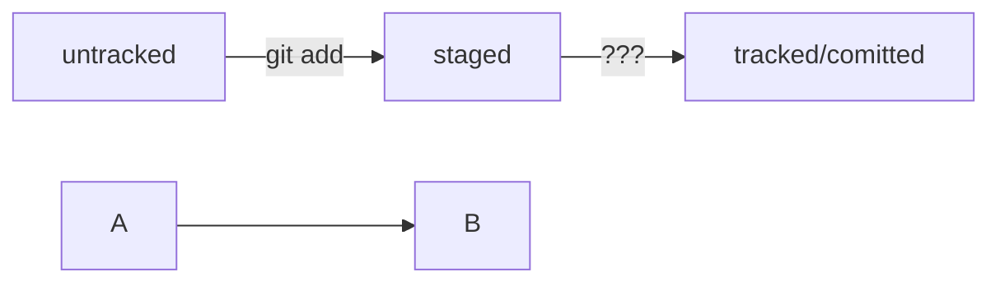

# Git and GitHub and co.    
---
---
### **1. Install Git(Bash)**  
### **2. Learn main commands to manipulate.**  
### **3. Create Git repository and memorize main commands.**  
### **4. Sign up in GitHub and create remote GitHub repository.**  
### **5. Find out how to connect local Git repositories and remote GitHub ones.**  
### **6. Git status, git log, git add, git commit -m, hashes, HEAD, statuses: untracked, modified, staged etc.**  
### **7. How to write proper commit's messages.**  
### **8. README.md files, learn creating this type of files and use it smartly. MARKDOWN.**  
### **9. Use Mermaid language schemes.**    
### **10. Use `git commit --amend --no-edit` or `git commit --amend -m "new message"` to edit the last commit(HEAD).**  
### **11.`git restore --staged <file>` and `git reset --hard <commit hash>` and `git restore <file>`**  
### **12. `git diff` and `git diff --staged` to see the difference.**  
### **13. `git diff` shows you the differences between modified; `git diff --staged` shows the differences btw in staged changes.
### and  there's `git diff <hash> <another hash>` that shows the changes btw commits with these hashes**  
### **14. Create .gitignore file to ignore some files or directories. It will not be tracked. And commit .gitignore before that **  
### Use special rules to do that. Like *, **, /, #, ?, file[0-9].txt for example.  
### **15. To copy a remote repository use `git clone + <SSH-key of the repository>`. It connect a remote rep. and a local rep. automaticaly.**  
### **16. `git branch` shows you all branches. `git branch <branch_name>` to create a branch. `git checkout <branch_name>` to switch to a new branch.**
### **`git checkout -b <branch-name>` to create and switch to a new branch. **  
### **17.`git diff <branch_name> <anpther_branch_name>` shows the difference btw these branches. Or use a hash instead of branch_name.**  
### **18. Use ~ to refer to the previous commits. For example: `git diff main~3 main` to compare the last commit(HEAD) in main branch and 4th commit from the end.**  
### **19. `git merge <branch_name>` to merge(join) two branches together. For deleting a branch use a command `git branch -D <branch_name>` or a lighter variant with flag `-d`.**  
---
---

